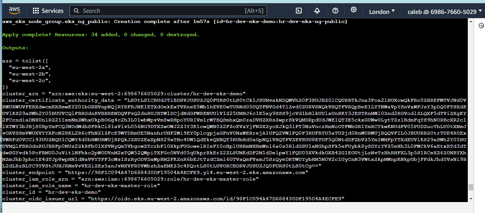
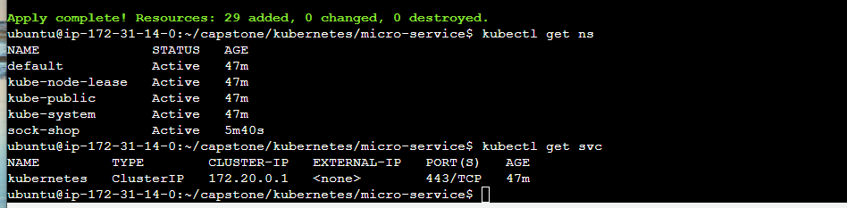
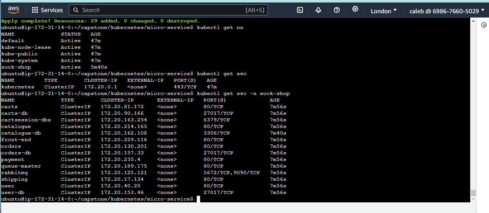
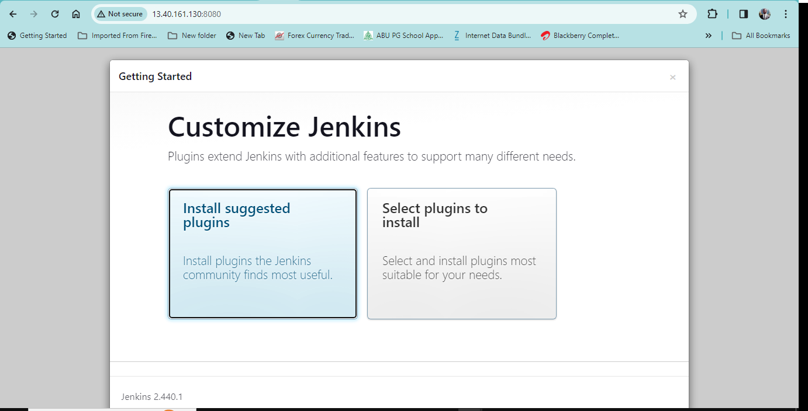
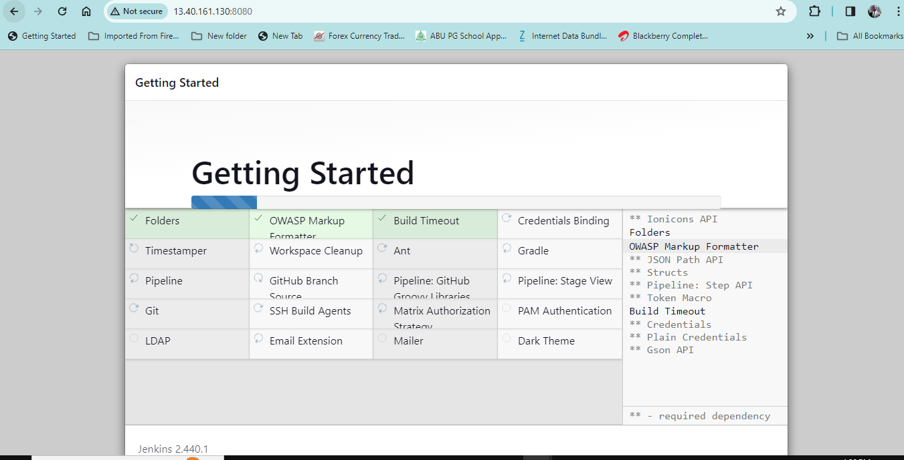
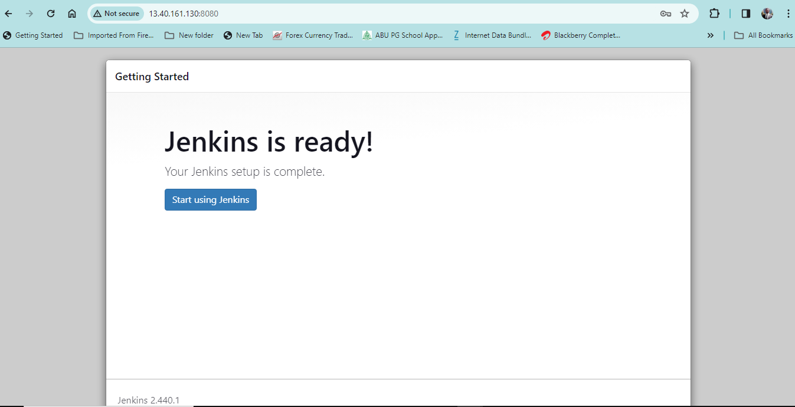
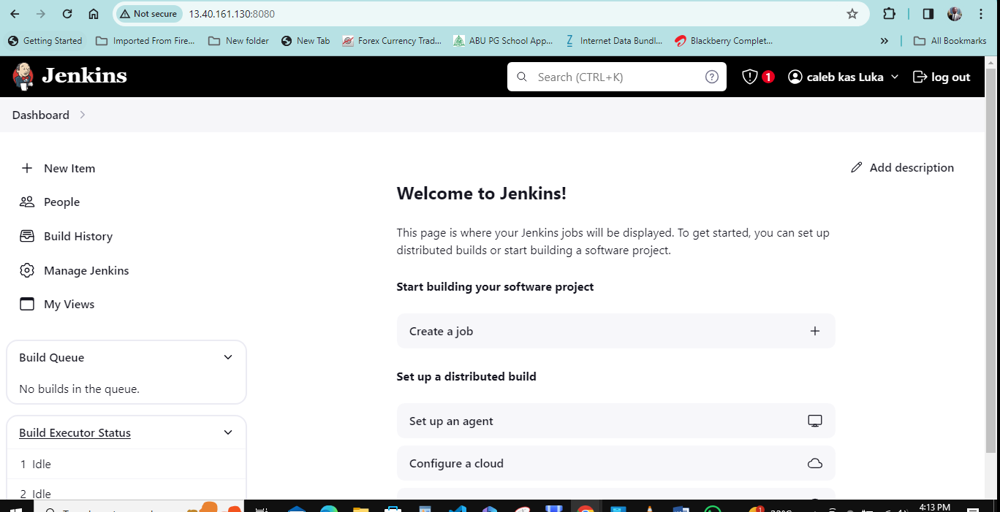
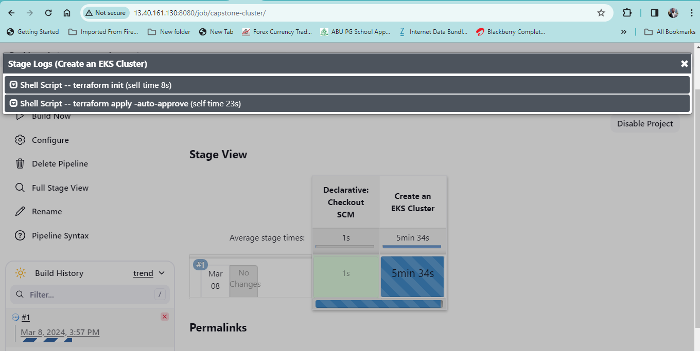
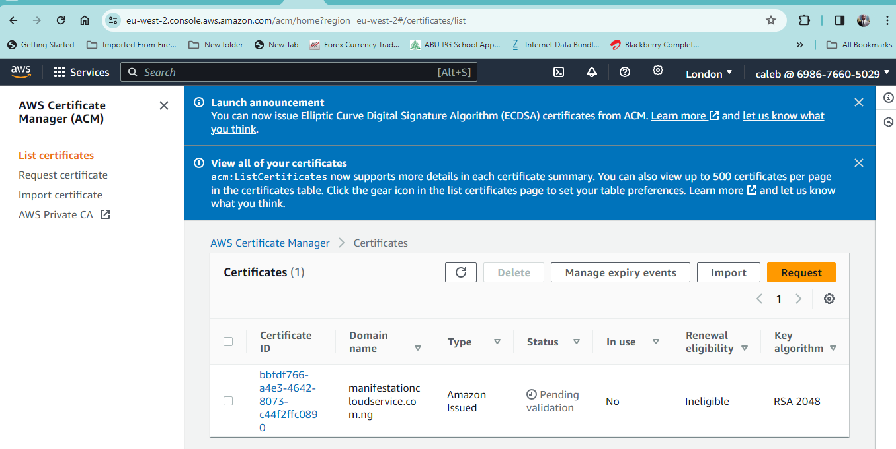

# DEPLOYMENT OF A MICROSERVICE-BASED APPLICATION USING AUTOMATED TOOLS.

This project deployed a microservices-based application using Jenkins and terraform to ensure quick, reliable, and secure deployment on Kubernetes. By focusing on Infrastructure as Code, Using terraform to create a reproducible and maintainable deployment process that leverages modern DevOps practices and tools.
$https://github.com/lukacaleb/capstone-sockshop.git

## ARCHITECTURAL DIAGRAM OF THE MICRO-SERVICE DEPLOYMENT ON AWS


## EXPLAINING THE REPOSITORIES.
### EKS DIRECTORY 
Amazon Elastic Kubernetes Service (Amazon EKS) is a managed Kubernetes service that makes it easy for you to run Kubernetes on AWS and on-premises. Kubernetes is an open-source system for automating deployment, scaling, and management of containerized applications. This directory contains all the files required to managr the elastic kubernetes service on aws intance.
[eks link](https://github.com/lukacaleb/capstone-sockshop/tree/main/eks)

### KUBERNETES DIRECTORY
A Kubernetes cluster is a set of nodes that run containerized applications. Containerizing applications packages an app with its dependences and some necessary services. They are more lightweight and flexible than virtual machines. In this way, Kubernetes clusters allow for applications to be more easily developed, moved and managed
The kubernetes directory contains all files required to automate the provisioning of the sock shop through jenkins pipeline 
https://github.com/lukacaleb/capstone-sockshop/tree/main/kubernetes

## EXPLAINING THE FILES. 


## THE PROCESS OF RUNING THE ENTIRE PROJECT WITH CODE AND PICTURES.
### the process starts with Selecting a region. One of the most important steps is to select the desired AWS region.

1. creat an ec2 in aws with a vpc having an ingress rule allowing all traffic, port 22, port 443 and port 80 while also having an egress rule allowing all traffic on ipv4 and ipv6.

2. clone the repository from github basically to run the istaller.sh with its dependences using the following command (./installer.sh)

```markdown
$git clone https://github.com/lukacaleb/capstone-sockshop.git
```

   

   optional 
   test on eks directory to find out if there is any error with the files.

   ```markdown
   $cd eks
   $terraform init
   $terraform apply --auto-approve
   $terraform destroy --auto-approve
   ```

   

   

   

3. copy the IP address of the ec2 instance on aws to the (xxx.xxx.xx.xx:8080) this will open the jenkins default page then click on 'intall suggested pluggins' to get started.

  

  

4. setup the environment and link jenkins with github and set the file path to both the jenkinsfile and cluster-jenkinsfile. 

 



5. this is the automated deployment of sockshop using the jenkinsfile and the deployment of the eks cluster using cluster-jenkinsfile.




6. many resources would be created on aws. two ec2 intances, vpc's for the instances, sockshop applications and grafana would be created on route53 and also nameservers that would copied and pointed to my domain name 
 ```markdown
 `$http://manifestationcloudservice.com.ng/`
 ```
 


 7. a secure certificate was created on aws certificate manager and after awhile it was issued. at this juncture the we can copy the both the sock-shop and grafana URL pointing to my domain name to the bowser to open the sock-shop and the grafana dashboard visually monitoring the microservice-base applications.despite the fact that a secured certificate on aws was issued both the sock-shop application and grafana dashboard were not secured on the browser.

 
 
