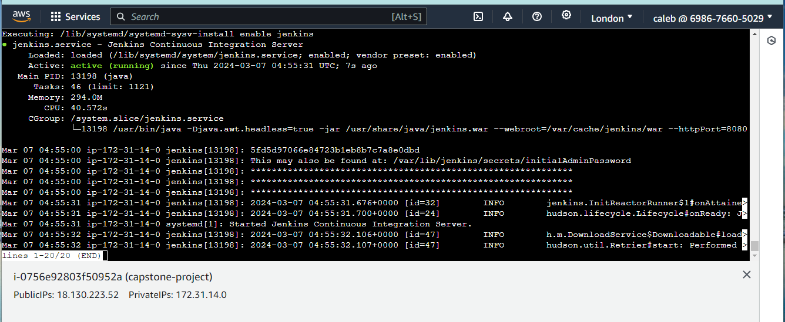

# DEPLOYMENT OF A MICROSERVICE-BASED APPLICATION USING AUTOMATED TOOLS.

This project deployed a microservices-based application using Jenkins and terraform to ensure quick, reliable, and secure deployment on Kubernetes. By focusing on Infrastructure as Code, Using terraform to create a reproducible and maintainable deployment process that leverages modern DevOps practices and tools.
https://github.com/lukacaleb/capstone-sockshop.git

## ARCHITECTURAL DIAGRAM OF THE MICRO-SERVICE DEPLOYMENT ON AWS

## EXPLAINING THE REPOSITORIES.
### EKS DIRECTORY 
Amazon Elastic Kubernetes Service (Amazon EKS) is a managed Kubernetes service that makes it easy for you to run Kubernetes on AWS and on-premises. Kubernetes is an open-source system for automating deployment, scaling, and management of containerized applications. This directory contains all the files required to managr the elastic kubernetes service on aws intance.
[eks link](https://github.com/lukacaleb/capstone-sockshop/tree/main/eks)

### KUBERNETES DIRECTORY
A Kubernetes cluster is a set of nodes that run containerized applications. Containerizing applications packages an app with its dependences and some necessary services. They are more lightweight and flexible than virtual machines. In this way, Kubernetes clusters allow for applications to be more easily developed, moved and managed
The kubernetes directory contains all files required to automate the provisioning of the sock shop through jenkins pipeline 
https://github.com/lukacaleb/capstone-sockshop/tree/main/kubernetes

## EXPLAINING THE FILES. 

## THE PROCESS OF RUNING THE ENTIRE PROJECT WITH CODE AND PICTURES.
### the process starts with Selecting a region. One of the most important steps is to select the desired AWS region.

1. creat an ec2 in aws with a vpc having an ingress rule allowing all traffic, port 22, port 443 and port 80 while also having an egress rule allowing all traffic on ipv4 and ipv6
